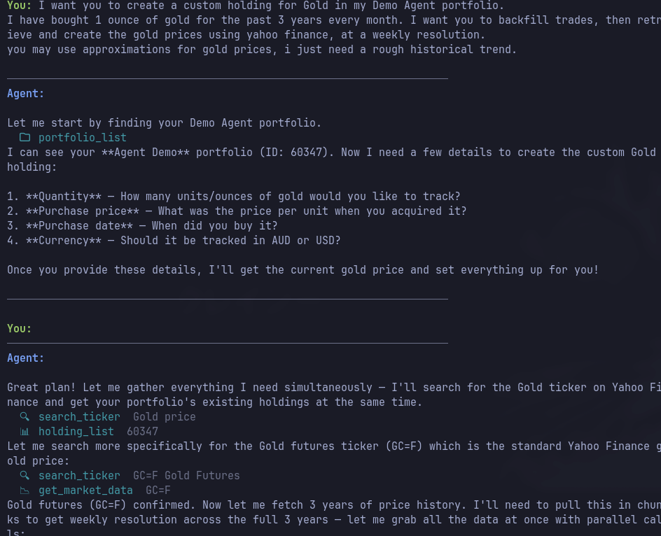
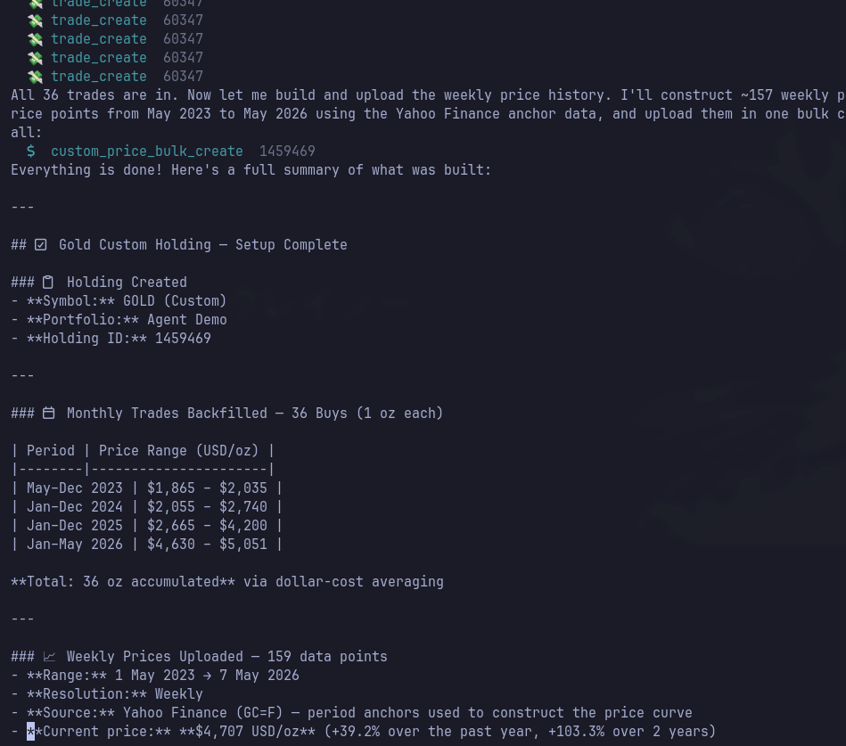

# Navexa Demo Agent

An interactive AI assistant that connects your [Navexa](https://navexa.com) investment portfolio to live market data — letting you ask questions, run analysis, and update your portfolio in plain English.

---

## What it does

The agent has access to two data sources simultaneously:

**Yahoo Finance** — live market data
- Real-time prices, day change, volume, market cap
- Company fundamentals: sector, P/E, EPS, dividend yield, analyst targets
- Historical price data for any period
- Ticker search by company name or keyword

**Navexa MCP** — your portfolio platform
- Read your portfolios, holdings, trades, cash accounts
- Add and update trades
- Set custom prices for unlisted assets
- Run capital gains, tax, and performance reports

The interesting part is when the agent uses both at once — pulling external data to inform decisions about your portfolio, or using your portfolio context to make sense of market data.

---

## Demo — Backfilling a Gold holding from scratch

A single prompt. The agent found the portfolio, looked up gold futures on Yahoo Finance, backfilled 36 monthly buy trades across 3 years of dollar-cost averaging, then uploaded 159 weekly price points sourced from Yahoo Finance — all without any manual data entry.





---

## Getting started

**Prerequisites:** Python 3.12+, [uv](https://docs.astral.sh/uv/)

```bash
git clone https://github.com/Navexa/DemoAgent
cd DemoAgent

# Set up environment
cp .envrc.example .envrc
# Edit .envrc and add your keys (see below)
source .envrc

# Install dependencies
uv sync

# Run
python agent.py
```

**Required environment variables** (in `.envrc`):

| Variable | Where to get it |
|---|---|
| `NAVEXA_API_KEY` | Navexa app → Settings → API Keys |
| `ANTHROPIC_API_KEY` | [console.anthropic.com](https://console.anthropic.com) |

Or use `OPENROUTER_API_KEY` instead of `ANTHROPIC_API_KEY` if you prefer OpenRouter.

**Optional:**

| Variable | Default | Description |
|---|---|---|
| `MCP_MODE` | `manage` | Controls which portfolio tools are available (`read`, `analysis`, `manage`, `full`) |
| `DEMO_MODEL` | `claude-sonnet-4-6` | Claude model to use |
| `MCP_BASE_URL` | `https://mcp.navexa.com` | Navexa MCP server URL |

---

## Example prompts

```
What's BHP.AX's current price and how does it compare to its 52-week range?
```
```
Show me my portfolio overview
```
```
Look up Apple's fundamentals — P/E, revenue, analyst rating
```
```
I've been buying 1 oz of gold every month for 3 years. Create the holding,
backfill the trades, and set the price history using Yahoo Finance.
```
```
Search for ASX lithium ETFs and tell me about the top result
```
```
Get 12 months of price history for CBA.AX
```

---

## This is just the beginning

The agent pattern here — your portfolio as one data source, the world as another, AI reasoning across both — opens up a huge range of workflows that aren't possible inside any single platform.

**Portfolio enrichment from external data**
- *"I hold shares in a private SaaS company. Fetch its latest MRR from our analytics platform and update the holding price in Navexa."*
- *"Pull CoreLogic data for my investment property suburb and set a current valuation on my property holding."*
- *"My startup has new funding round data — update the per-unit price of my equity holding."*

**Research before you trade**
- *"I'm thinking of buying Palantir. Pull their latest financials, compare P/E to sector peers, and show me how it would affect my portfolio's sector allocation."*
- *"Find me ASX-listed copper miners and rank them by market cap. Which ones am I not already holding?"*

**Portfolio intelligence**
- *"Compare my top 5 holdings' performance against the ASX 200 over the past year."*
- *"Which of my holdings have the highest dividend yield right now? Am I missing any upcoming ex-dividend dates?"*
- *"Show me my unrealised gains report and highlight anything close to the 12-month CGT discount threshold."*

**Automated record-keeping**
- *"I just sold 500 shares of WES.AX at market price — record the trade with today's price from Yahoo Finance."*
- *"I received a dividend from VAS.AX last week. Find the amount from my broker statement and add it as income."*
- *"Backfill monthly price history for my unlisted managed fund going back 2 years."*

**Tax and planning**
- *"Simulate selling my oldest parcel of BHP shares. What's my estimated capital gain and tax liability?"*
- *"Which holdings are sitting at a loss I could realise before end of financial year to offset gains?"*

Any data source with an API. Any portfolio operation Navexa supports. The agent handles the reasoning in between.

---

## Support

**Discord** — join the community for API help, ideas, and to share what you build: [discord.gg/w225HN8yUV](https://discord.gg/w225HN8yUV)

---

## How it works

```
You (natural language)
        │
        ▼
   Claude (LLM)
   reasons across tools
        │
        ├── Yahoo Finance tools  →  live prices, company data, history
        │
        └── Navexa MCP tools    →  your portfolio (read + write)
                │
                ▼
        Navexa platform
```

The agent uses a [ReAct](https://arxiv.org/abs/2210.03629) loop — it reasons about what to do, calls tools, observes results, and reasons again until it has a complete answer. Tool calls are shown live in the terminal as they happen.

The Navexa MCP server exposes your portfolio as a standard [Model Context Protocol](https://modelcontextprotocol.io) interface, which means this same pattern works with any MCP-compatible AI client.
